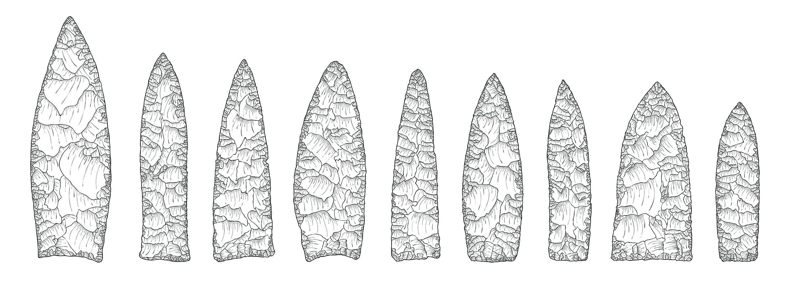

# gahaganmorph

This article, entitled "Lithic Morphological Organisation: Gahagan Bifaces from the Southern Caddo Area," was published in [Digital Applications in Archaeology and Cultural Heritage](https://doi.org/10.1016/j.daach.2018.e00080) in 2018, and the preprint is available for download on [SocArXiv](https://osf.io/preprints/socarxiv/u7qfr/). The LaTeX scripts are included in this repository, and can be viewed on [Overleaf](https://www.overleaf.com/read/xtrkwwhwyryg). The gahagan-analysis file contains the dataset (landmarks and semilandmarks) and R scripts used for the analysis. Unprocessed data have been uploaded to the Open Science Framework, and the processed meshes to Zenodo @ CERN. Those data are embargoed for a period of five years, as the analysis of these bifaces is ongoing.

### Abstract

This analysis of Gahagan biface morphology enlists the three largest samples of Gahagan bifaces, to include that of the type site (Gahagan Mound) as well as the Mounds Plantation and George C. Davis sites. Results indicate a significant difference in Gahagan biface morphology at the Mounds Plantation site when compared with Gahagan bifaces from the Gahagan Mound and George C. Davis sites. Tests for allometry and asymmetry were not significant. The test of morphological disparity indicates that Gahagan bifaces produced at the Mounds Plantation site occupy a more restricted range of morphospace than those produced at Gahagan Mound, providing indirect evidence for standardisation and diversity in Caddo biface production. While the sample includes a wide range of variation in biface shapes, the test of morphological integration indicates that Gahagan bifaces are significantly integrated, meaning that those traits used to characterise their shape (blade and base) vary in a coordinated manner. These results articulate with a shift in Caddo bottle morphology over the same geography, potentially indicating two previously unrecognised and morphologically-distinct lithic and ceramic production areas.